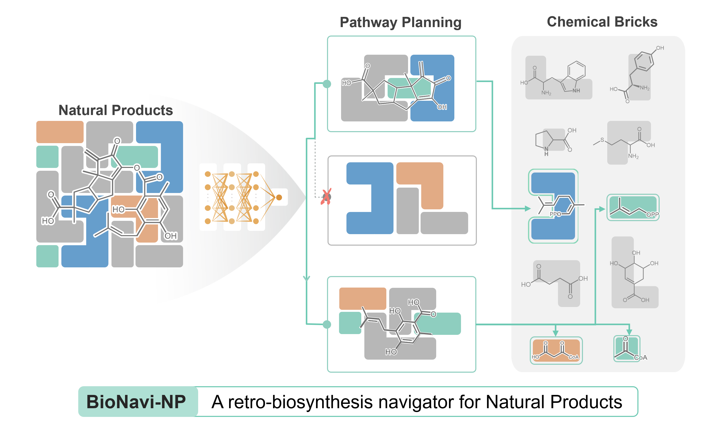

#### Introduction
Source code for the paper "Deep Learning Driven Biosynthesis Pathways Navigation for Natural Products with  BioNavi-NP" in *[Nature Communications](https://www.nature.com/articles/s41467-022-30970-9)*. The server can be found [here](http://biopathnavi.qmclab.com/).




####  Setup
BioNavi-NP requires anaconda with python 3.7 or later, cudatoolkit=11.1. 

You will wish to install BioNavi-NP in a virtual environment to prevent conflicting dependencies.

```python
sudo apt-get install graphviz # for output visualization
conda create -n biosynthesis python==3.7
conda activate biosynthesis
cd multistep
sh install.sh
```
BioNavi-NP has been tested on Ubuntu 18.04, with four GPUs (Nvidia RTX3090). Installation should take no longer than 20 minutes on a modern server.

#### Planning
Demo code for multi-step planning has been placed in```run_biosynthesis.py```.

Run

```python
python run_biosynthesis.py
```

This demo now will take only 20 seconds with single GPU (Nvidia RTX3090). One need to first download the [checkpoints](https://drive.google.com/file/d/17DWd5K9vKUV3ynTbUA1yt_7YO0Xpts7c/view?usp=sharing) and unzip under ```biosynthesis/singlestep/checkpoints/``` to run the demo.  The output will be visulized in ```viz_dir```. 


The key functions are shown in the following block, You may run your own molecule by changing the 'target_mol' in  ```main_biosynthesis()```.

```python
def main_biosynthesis():
    input_dict = {
        'target_mol': 'N[C@@H](CNC(=O)C(=O)O)C(=O)O', # input molecule
        'expansion_topk': 50,
        'max_depth': 10,
        'expansion_iters': 10,
        'route_topk': 5,
        #'building_blocks': ['N[C@@H](CO)C(=O)O'] # one can assign a specific building block with this command
        'building_blocks':'retro_star/dataset/bio_data/bio_building_blocks_all/building_block.csv'
    }
    

    res = run(input_dict)
    print(res)
  
def run(input_dict):
    os.environ['CUDA_VISIBLE_DEVICES'] = '0, 1, 2, 3'

    # canonicalization
    mol = Chem.MolToSmiles(Chem.MolFromSmarts(input_dict['target_mol']))
    # the trained checkpoints path, one can simply reduce the checkpotins to accelerate the prediction. 
    one_step_model_path = [                                          
        '../singlestep/checkpoints/np-like/model_step_30000.pt',
        '../singlestep/checkpoints/np-like/model_step_50000.pt',
        '../singlestep/checkpoints/np-like/model_step_80000.pt',
        '../singlestep/checkpoints/np-like/model_step_100000.pt'
    ]                                                             
    value_fn_model_path = './retro_star/saved_models/best_epoch_final_4.pt'
    viz_dir = os.path.join('viz_' + str(int(time.time()))) # the output path with visualization
    ret_file_path = os.path.join('./viz/tmp/', viz_dir + '.zip')
    planner = RSPlanner(
        gpu=get_avai_gpu(),
        use_value_fn=True,
        value_fn_model_path=value_fn_model_path,
        fp_dim=2048,
        iterations=input_dict['expansion_iters'],
        expansion_topk=input_dict['expansion_topk'],
        route_topk=input_dict['route_topk'],
        one_step_model_type='onmt',
        buliding_block_path=input_dict['building_blocks'],
        mlp_templates_path=None,
        one_step_model_path=one_step_model_path,
        beam_size=20,
        viz=True,
        viz_dir=viz_dir 
    )

    result = planner.plan(mol)

    return result

```


#### Testing on the test set

Our work on BioNavi-NP features an evaluation on our test-set. We automated this evaluation by

```python
python run_batch_by_building_blocks.py
```
The whole process takes around 17 hours on four GPU (Nvidia RTX3090). One could modify the data_path and building_block_path in the script according to their own installation path. 


#### Citation

Please cite the following paper if you use this code in your work.

Zheng, S., Zeng, T., Li, C. et al. Deep learning driven biosynthetic pathways navigation for natural products with BioNavi-NP. Nat Commun 13, 3342 (2022). https://doi.org/10.1038/s41467-022-30970-9
